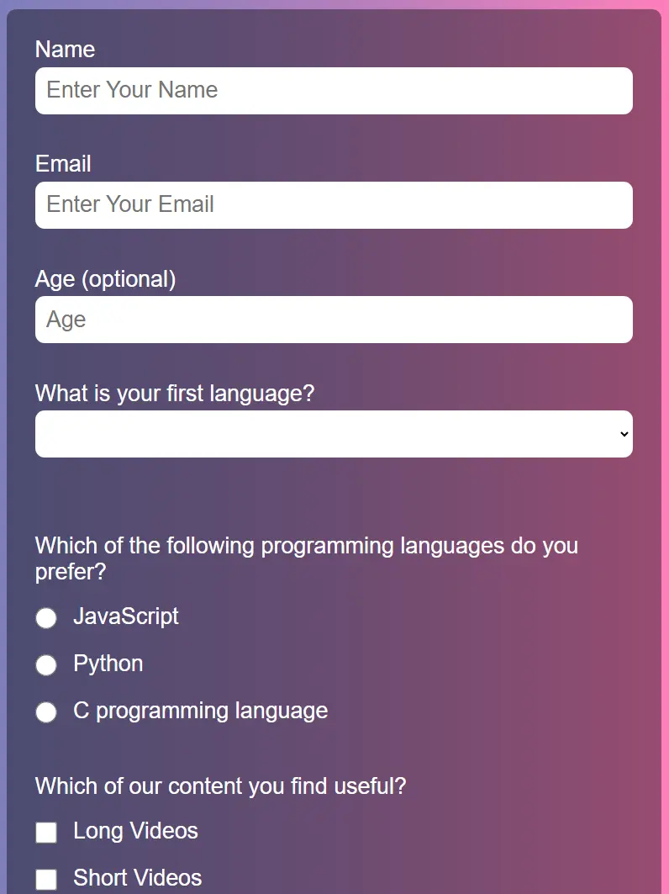

# Portfolio Webpage — Performance & Accessibility Enhancements

## Results

| Metric         | Before                                                                                                                                                 | After                                                                                                                                                 |
| -------------- | ------------------------------------------------------------------------------------------------------------------------------------------------------ | ----------------------------------------------------------------------------------------------------------------------------------------------------- |
| Performance    | 84                                                                                                                                                     | 89 Mobile, 99 Desktop                                                                                                                                 |
| Accessibility  | 85                                                                                                                                                     | 100                                                                                                                                                   |
| Best Practices | 100                                                                                                                                                    | 100                                                                                                                                                   |
| SEO            | 100                                                                                                                                                    | 100                                                                                                                                                   |
| LCP            | ~3.5 s                                                                                                                                                 | ~3.0 s                                                                                                                                                |
| CLS            | 0                                                                                                                                                      | 0.005                                                                                                                                                 |
| TBT            | 0ms                                                                                                                                                    | 0 ms                                                                                                                                                  |
| Report         | [Feb 28, 2026](https://pagespeed.web.dev/analysis/https-mafdi01-github-io-responsive-designs-Personal-Portfolio-Webpage/5blplb0tj5?form_factor=mobile) | [Mar 1, 2026](https://pagespeed.web.dev/analysis/https-mafdi01-github-io-responsive-designs-Personal-Portfolio-Webpage/mw7lr5tmhg?form_factor=mobile) |

---

## HTML Changes

### 1. Google Fonts — sync load → async preload

The original `<link rel="stylesheet">` for Google Fonts blocked rendering until the CDN responded.

```html
<!-- Before -->
<link href="https://fonts.googleapis.com/css2?family=Chakra+Petch:ital,wght@0,300;0,400;0,500;0,600;0,700;1,300;1,400;1,500;1,600;1,700&...&display=swap"
  rel="stylesheet">

<!-- After -->
<link rel="preload" as="style"
  href="https://fonts.googleapis.com/css2?family=Chakra+Petch:ital,wght@1,400;1,700&...&display=swap"
  onload="this.onload=null;this.rel='stylesheet'">
<noscript>
  <link href="..." rel="stylesheet">
</noscript>
```

`rel="preload"` has the highest browser fetch priority and is resolved during HTML parsing. A `<noscript>` fallback handles users without JavaScript.

---

### 2. Chakra Petch — 7 weights narrowed to 2

The font was requested in 7 weights across 2 styles (up to 14 woff2 files). The page only uses italic 400 and italic 700.

```
Before: Chakra+Petch:ital,wght@0,300;0,400;0,500;0,600;0,700;1,300;1,400;1,500;1,600;1,700
After:  Chakra+Petch:ital,wght@1,400;1,700
```

---

### 3. Font Awesome — `all.min.css` → `brands.min.css` + async

`all.min.css` (135 KB) contains every icon category. The page uses only `fa-brands` icons.

```html
<!-- Before: synchronous, full library -->
<link rel="stylesheet" href=".../css/all.min.css">

<!-- After: brands-only subset, loaded async -->
<link rel="stylesheet" href=".../css/brands.min.css"
  media="print" onload="this.media='all'">
<link rel="stylesheet" href=".../css/fontawesome.min.css"
  media="print" onload="this.media='all'">
```

---

### 4. Images — explicit `width`/`height` added

Missing dimensions caused the browser to reflow the layout as images loaded, producing a high CLS score.

```html
<!-- Before -->


<!-- After -->

```

---

### 5. Images — responsive `srcset` added

Each image was a single oversized file downloaded regardless of screen size (~108 KB wasted on mobile).

```html
<!-- Before -->


<!-- After -->

```

Two resized `.webp` files per image were generated locally with `sharp` at the exact display widths (298/596px for standard tiles, 455/910px for wide tiles).

---

### 6. Social links — `aria-label` and `aria-hidden`

Icon-only links had no accessible name. Screen readers announced them as unlabeled links.

```html
<!-- Before -->
<a href="https://github.com/mafdi01" target="_blank" style="...">
  <i class="fa-brands fa-github"></i>
</a>

<!-- After -->
<a href="https://github.com/mafdi01" target="_blank" rel="noopener noreferrer"
  aria-label="GitHub profile" style="...">
  <i class="fa-brands fa-github" aria-hidden="true"></i>
</a>
```

---

### 7. `target="_blank"` links — `rel="noopener noreferrer"` added

All external links were missing the security attribute, exposing the page to tab-napping.

```html
<!-- Before -->
<a target="_blank" href="...">

<!-- After -->
<a target="_blank" rel="noopener noreferrer" href="...">
```

---

### 8. Animation toggle — `<article>` → `<div>`

`<article>` is reserved for self-contained distributable content, not UI controls.

```html
<!-- Before -->
<article id="ctrl-animation"> ... </article>

<!-- After -->
<div id="ctrl-animation"> ... </div>
```

`aria-label="Toggle animations"` was also added to the `<input>`.

---

### 9. `<nav>` — accessible label added

```html
<!-- Before -->
<nav id="navbar">

<!-- After -->
<nav id="navbar" aria-label="Main navigation">
```

---

## CSS Changes

### 10. Animations — `margin-left` → `transform: translateX`

`margin-left` is a layout property; animating it forces a full layout and paint pass every frame (non-composited), causing jank and CLS.

```css
/* Before */
@keyframes to-right { 100% { margin-left: calc(100% - var(--project-tile-width)); } }
@keyframes to-left  { 100% { margin-left: 0; } }

.project-tile:nth-of-type(even) {
  margin-left: calc(100% - var(--project-tile-width));
  animation: alternate 10s infinite linear to-left;
}

/* After */
#projects { container-type: inline-size; }

@keyframes slide {
  0%   { transform: translateX(0); }
  100% { transform: translateX(calc(100cqi - var(--project-tile-width) - 2rem)); }
}

.project-tile:nth-of-type(odd)  { animation: alternate         10s infinite linear slide; }
.project-tile:nth-of-type(even) { animation: alternate-reverse 10s infinite linear slide; }
```

`transform: translateX` runs on the GPU compositor thread. `container-type: inline-size` enables the `100cqi` unit so the translation distance references the parent width, not the element itself.

---

### 11. `#profiles h2` contrast ratio fixed

```css
/* Before: #A4FC1E on #D67A3C = 2.4:1 — fails WCAG AA */
#profiles h2 { color: var(--color-5-alt); }

/* After: #121113 on #D67A3C = 6.4:1 — passes WCAG AA and AAA */
#profiles h2 { color: var(--color-1); }
```

---

### 12. Font Awesome `font-display: swap`

The CDN stylesheet omits `font-display`, defaulting to `block` — hiding icons for up to 3 seconds. A `@font-face` declaration in `styles.css` overrides it.

```css
/* Added */
@font-face {
  font-family: 'Font Awesome 6 Brands';
  font-style: normal;
  font-weight: 400;
  font-display: swap;
  src: url('.../fa-brands-400.woff2') format('woff2'),
       url('.../fa-brands-400.ttf') format('truetype');
}
```

---

### 13. Chakra Petch metrics-adjusted fallback font

When Chakra Petch swaps in via `font-display: swap`, the system fallback (Arial) has different line metrics, causing a layout reflow that increments CLS.

```css
/* Added */
@font-face {
  font-family: 'Chakra Petch Fallback';
  src: local('Arial');
  size-adjust: 96%;
  ascent-override: 95%;
  descent-override: 25%;
  line-gap-override: 0%;
}

.small-display,
.project-tile h3 {
  /* Before */
  font-family: "Chakra Petch", sans-serif;

  /* After */
  font-family: "Chakra Petch", "Chakra Petch Fallback", sans-serif;
}
```

---

### 14. Keyboard focus styles added

No `:focus-visible` rules existed — keyboard users had no visual indicator of focused elements (WCAG 2.4.7).

```css
/* Added */
:focus-visible {
  outline: 3px solid var(--color-5-alt);
  outline-offset: 3px;
  border-radius: 2px;
}
```

---

### 15. `prefers-reduced-motion` media query added

Users who set "Reduce Motion" in their OS were not respected at the CSS level (WCAG 2.3.3).

```css
/* Added */
@media (prefers-reduced-motion: reduce) {
  *, *::before, *::after {
    animation-duration: 0.01ms !important;
    animation-iteration-count: 1 !important;
    transition-duration: 0.01ms !important;
    scroll-behavior: auto !important;
  }
}
```

---

### 16. `z-index` added to `header`

Without `z-index`, the GPU-composited animated tiles could render on top of the fixed header during animation.

```css
/* Added */
header { z-index: 10; }
```

---

### 17. `#logo-container` — `gap` replaced `margin`

```css
/* Before */
#logo-container a { margin: .7rem; }

/* After */
#logo-container { gap: .7rem; }
#logo-container a { /* margin removed */ }
```

---

## Remaining Opportunities

| Issue                                          | Est. Savings           | What Is Required                                                                |
| ---------------------------------------------- | ---------------------- | ------------------------------------------------------------------------------- |
| Image cache TTL (GitHub Pages fixed at 10 min) | 172 KB on repeat loads | Route domain through Cloudflare (free) with a custom cache rule for `/images/*` |
